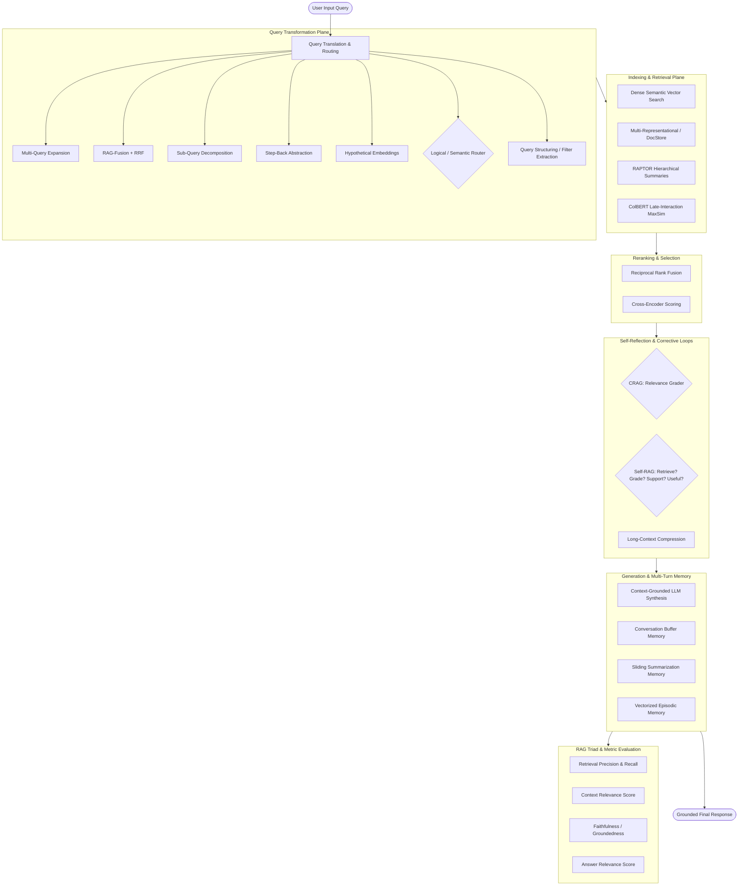
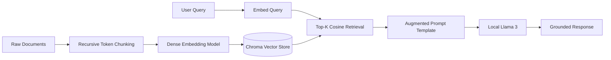
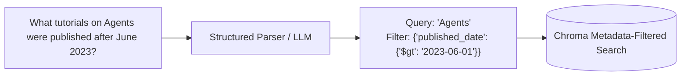
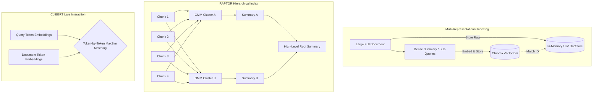
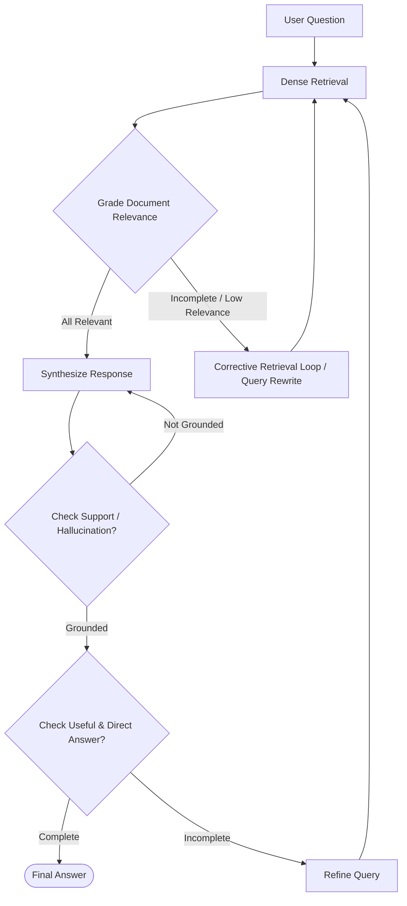
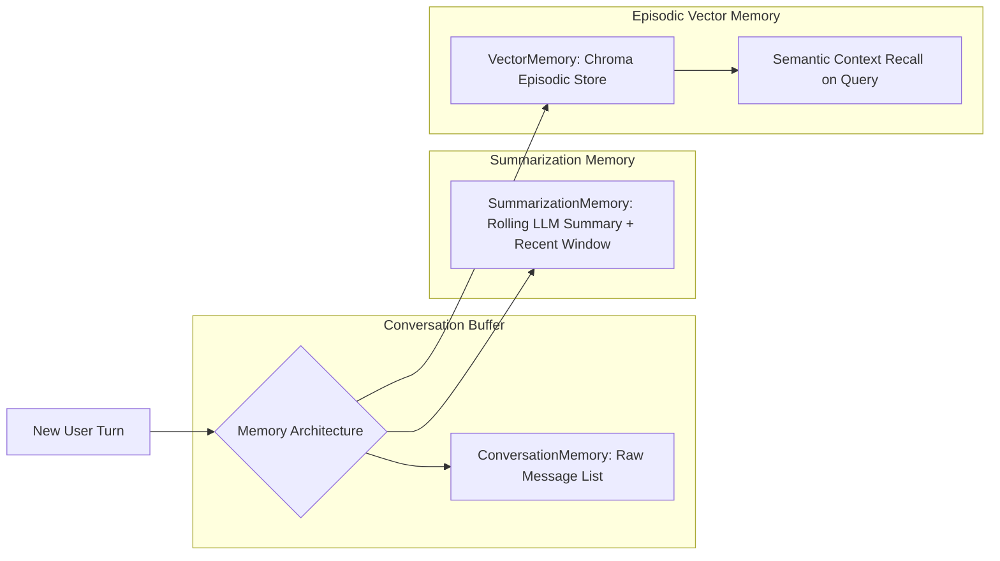
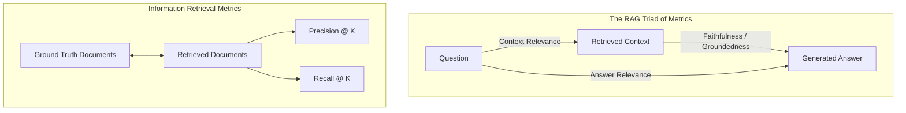
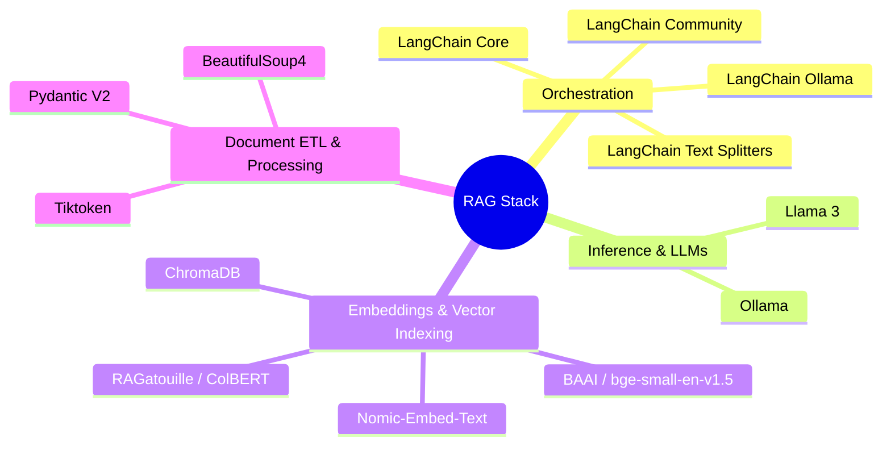

# RAG From Scratch: Comprehensive Architecture & Implementations

[](https://www.python.org/)
[](https://www.langchain.com/)
[](https://www.trychroma.com/)
[-black.svg)](https://ollama.ai/)
[](https://github.com/stanford-futuredata/ColBERT)
[](https://gitmcp.io/Arjun-Bhattarai/RAG-from-scratch)

> **Prerequisites & Foundation:** This project builds upon foundational language modeling principles covered in **[LLMs from Scratch](https://github.com/Arjun-Bhattarai/LLMs)** (covering Transformer internals, attention mechanisms, and GPT architectures).

---

## Executive Overview

**RAG From Scratch** is an architectural and algorithmic reference implementation of modern **Retrieval-Augmented Generation (RAG)** systems. Built from first principles, this repository systematically dismantles and implements every phase of production-grade retrieval systems—moving from naive baseline pipelines to multi-layered query transformations, hierarchical tree indexers, late-interaction neural search, corrective feedback loops, multi-turn memory systems, and quantitative evaluation frameworks.

Rather than relying on monolithic wrappers, every module isolates specific operational bottlenecks (e.g., semantic drift, vocabulary mismatch, chunk boundary fragmentation, hallucination, out-of-context retrieval) and solves them with concrete algorithmic patterns.

---

## Core System Architecture

The complete lifecycle of modern RAG spans eight distinct engineering planes:



---

## Comprehensive Module Breakdown

---

### 1. Core Baseline Pipeline

The baseline pipeline establishes the fundamental extract-transform-load (ETL) and inference chain of RAG.



* **End-to-End Baseline (`basic_rag`)**: Implements ingestion of unstructured web data (via `WebBaseLoader`), recursive token-aware chunking, vectorization, and deterministic generation using local Ollama (`llama3:latest`).
* **Document Chunking & Indexing (`indexing_rag`)**: Investigates the mechanics of chunk size vs. chunk overlap tradeoffs. Evaluates fixed-character vs. token-encoded (`tiktoken`) splitters to maintain semantic boundary integrity.
* **Retrieval Dynamics (`retrieval_rag`)**: Demonstrates dense vector similarity algorithms, distance metrics (Cosine Similarity, Euclidean Distance, Dot Product), and Maximal Marginal Relevance (MMR) for balancing semantic relevance against result diversity.
* **Context-Grounded Generation (`generation_rag`)**: Formulates strict prompt boundaries to enforce context adherence, mitigate model hallucinations, and parse structured output streams via `StrOutputParser`.

---

### 2. Query Translation & Transformation

Raw user queries are often ambiguous, under-specified, or mismatched with the terminology in the indexed documents. Query translation reformulates inputs before retrieval.

```mermaid
flowchart TD
    subgraph MultiQuery_Flow [Multi-Query / RAG-Fusion]
        Q1[Raw Query] --> GenQ[LLM Generates N Diverse Queries]
        GenQ --> RetAll[Retrieve Top-K per Query]
        RetAll --> RRF_Calc[Reciprocal Rank Fusion Scoring]
        RRF_Calc --> FusedDocs[Deduplicated & Reordered Context]
    end

    subgraph Decomposition_Flow [Query Decomposition]
        Q2[Complex Query] --> Decomp[Sub-Question Breakdown]
        Decomp --> Step1[Answer Sub-Question 1]
        Step1 --> Step2[Answer Sub-Question 2 with Prior Context]
        Step2 --> FinalSynth[Final Consolidated Synthesis]
    end

    subgraph HyDE_Flow [HyDE Paradigm]
        Q3[Raw Query] --> GenHypo[LLM Generates Hypothetical Answer]
        GenHypo --> EmbedHypo[Embed Hypothetical Doc]
        EmbedHypo --> SearchReal[Retrieve Matching Real Documents]
    end
```



* **Multi-Query Expansion (`multi_query`)**: Uses prompt-driven query variation to address different lexical angles of a user's question, querying the vector database simultaneously across multiple semantic directions to maximize recall.
* **RAG-Fusion & Reciprocal Rank Fusion (`rag_fusion`)**: Extends multi-query retrieval by running reciprocal rank fusion across multiple retrieval result sets:
  $$\text{RRF\_Score}(d \in D) = \sum_{m \in M} \frac{1}{k + r_m(d)}$$
  *(where $k=60$ dampens the outlier effect of top rankings)*.
* **Query Decomposition (`decomposition`)**: Solves complex multi-hop queries by breaking them down into discrete sub-problems. Supports both sequential dependency execution (passing intermediate answers forward) and parallel sub-query execution.
* **Step-Back Prompting (`step_back`)**: Prompts the LLM to step back and derive high-level concepts and foundational principles behind a specific question. It performs dual retrieval—fetching both high-level context and specific context—giving the synthesizer comprehensive domain depth.
* **Hypothetical Document Embeddings - HyDE (`HyDE`)**: Converts retrieval from "query-to-document" space into "document-to-document" space. Generates a hypothetical answer passage first, vectors that passage, and uses its embedding to retrieve genuine documents with matching semantic density.

---

### 3. Query Routing Strategies

Directing every query to a single vector index is inefficient and prone to noise. Intelligent routing directs queries to specialized data stores or pipelines.

| Routing Mechanism | Decision Engine | Latency Profile | Primary Use Case |
| :--- | :--- | :--- | :--- |
| **Logical Routing (`logical_routing`)** | LLM Structured Output / JSON Schema | High precision, moderate latency | Multi-database selection, API parameter binding, domain switching |
| **Semantic Routing (`semantic_routing`)** | Embedding Cosine Distance to Prototypes | Ultra-low latency, zero LLM calls | Intent classification, static prompt branch selection, fast FAQ routing |

* **Logical Routing**: Employs constrained LLM schemas to inspect query intent and route queries deterministically to specialized data sources (e.g., Python documentation vs. JavaScript documentation vs. General Knowledge).
* **Semantic Routing**: Maintains dense centroid embeddings for distinct topics or personas. Incoming queries are embedded and matched against route centroids using vector distance thresholds, executing branch routing without LLM latency.

---

### 4. Query Structuring & Metadata Filtering

Unstructured semantic search fails when queries contain temporal constraints, categorization, or numerical filters.



* **Natural Language to Filter Translation (`query_structuring`)**: Uses structured output parsing to separate semantic search keywords from structured metadata criteria (e.g., publication dates, document author, category tags, rating thresholds), executing high-precision metadata-filtered vector queries.

---

### 5. Advanced Indexing Paradigms

Traditional fixed-size chunking forces a tradeoff: small chunks lose broader context, while large chunks dilute semantic search vectors.



* **Multi-Representational Indexing (`multi_representational_indexing`)**: Decouples the vector representation used for retrieval from the context fed to the LLM. Embeds concise LLM-generated summaries or hypothetical questions into Chroma, while indexing the complete parent document in a Key-Value DocStore for full context preservation upon retrieval.
* **RAPTOR (`Raptor`)**: *Recursive Abstractive Processing for Tree-Organized Retrieval*. Recursively clusters document chunks using Gaussian Mixture Models (GMM) and embedding similarity, generates abstractive summaries for each cluster via LLM, and re-clusters the summaries into a hierarchical tree. Enables simultaneous retrieval of high-level thematic context and granular detail.
* **ColBERT / Late Interaction (`ColBERT`)**: Replaces single-vector document compression with token-level embeddings via RAGatouille. Computes late-interaction relevance using the $\text{MaxSim}$ operator across all query and document token vectors, capturing fine-grained phrase-level alignments without cross-encoder latency:
  $$\text{Score}(Q, D) = \sum_{i \in Q} \max_{j \in D} \left( E(Q)_i \cdot E(D)_j^T \right)$$

---

### 6. Reranking Systems

First-stage retrieval prioritizes recall across large corpora. Second-stage reranking scores the retrieved candidates with high-precision models before context injection.

* **Two-Stage Reordering (`reranking`)**: Evaluates retrieved top-$k$ candidates ($k \approx 10\text{--}20$) and applies secondary relevance scoring via Reciprocal Rank Fusion and cross-scoring functions to select the optimal top-$p$ ($p \approx 3\text{--}5$) contexts, eliminating context window pollution.

---

### 7. Advanced & Agentic RAG Frameworks

Deterministic linear pipelines cannot recover when retrieval returns irrelevant or contaminated information. Agentic RAG introduces self-reflection, automated grading, and corrective loops.



#### Self-RAG (Self-Reflective RAG)
Self-RAG implements an autonomous control loop utilizing explicit evaluation checks:
1. **Retrieval Decision (`should_retrieve`)**: Evaluates if the question requires external factual grounding or can be addressed directly.
2. **Relevance Grading (`grade_documents`)**: Iterates through every retrieved document and scores relevance ($Y / N$), pruning noisy chunks.
3. **Context Construction (`build_context`)**: Formulates filtered context buffers from approved chunks.
4. **Answer Generation (`generate_answer`)**: Generates response strictly bound to verified context.
5. **Support & Groundedness Verification (`check_support`)**: Evaluates if the generated claims are fully supported by context (hallucination grading).
6. **Query Refinement (`rewrite_chain`)**: Rewrites the query into an optimized search representation if the response is unsupported or retrieval yields zero relevant documents.

#### Corrective RAG (CRAG)
1. Performs initial candidate retrieval from vector storage.
2. Evaluates the retrieved documents using an automated relevance evaluator.
3. If confidence is below threshold or zero relevant documents are found, activates corrective retrieval fallback (expanding retrieval depth $k$ and falling back to broad context search).
4. Assembles clean context for final generation.

#### Long-Context Synthesis & Compression (`Long_Context`)
1. Aggregates large multi-document contexts for long-context LLMs.
2. Applies query-directed context compression prompts to extract only query-relevant facts.
3. Filters redundant noise while preserving critical numerical and factual data points prior to synthesis.

---

### 8. Multi-Turn Conversational Memory

Standard RAG pipelines are stateless. The memory module provides three tiers of conversational state retention:



* **`ConversationMemory`**: Maintains an exact conversational message history buffer across user and assistant turns.
* **`SummarizationMemory`**: Implements a sliding window memory architecture. Retains the most recent $k$ dialogue turns in verbatim format while using an LLM to maintain and update a running background summary of older dialogue turns, preserving long-term facts without token exhaustion.
* **`VectorMemory`**: Indexes past user and assistant interactions into a Chroma vector collection. When a new query arrives, relevant historical turns are retrieved semantically, providing long-term associative recall across extended multi-session interactions.

---

### 9. Quantitative Evaluation & The RAG Triad

A robust RAG system requires deterministic evaluation across both retrieval and generation quality.



| Evaluation Dimension | Metric | Measurement Method | Evaluator Target |
| :--- | :--- | :--- | :--- |
| **Retrieval Quality** | **Precision @ K** | $\frac{\|\text{Relevant} \cap \text{Retrieved}\|}{\|\text{Retrieved}\|}$ | Quantifies proportion of retrieved chunks that are actually relevant |
| **Retrieval Quality** | **Recall @ K** | $\frac{\|\text{Relevant} \cap \text{Retrieved}\|}{\|\text{Relevant}\|}$ | Quantifies proportion of all relevant domain chunks successfully retrieved |
| **RAG Triad** | **Context Relevance** | LLM-as-a-Judge (`RELEVANT` / `NOT_RELEVANT`) | Determines if the retrieved context is focused and free of irrelevant noise |
| **RAG Triad** | **Faithfulness** | LLM-as-a-Judge (`FAITHFUL` / `NOT_FAITHFUL`) | Verifies that all generated claims are grounded in context (zero hallucinations) |
| **RAG Triad** | **Answer Relevance** | LLM-as-a-Judge (`RELEVANT` / `NOT_RELEVANT`) | Verifies that the answer directly and completely addresses the user query |

---

## Technical Stack & Dependencies



---

## Model Context Protocol (MCP) Integration

This repository natively exposes its architectural documentation, implementations, and notebooks to MCP-compatible AI developer tools (Cursor, Claude Desktop, Windsurf, Cline, and VS Code) via **GitMCP**.

MCP server configuration endpoint:

```json
{
  "servers": {
    "RAG-from-scratch Docs": {
      "type": "sse",
      "url": "https://gitmcp.io/Arjun-Bhattarai/RAG-from-scratch"
    }
  }
}
```

---

## Roadmap & Advanced Paradigms

- [x] Baseline RAG Pipeline (Ingestion, Chunking, Dense Indexing, Generation)
- [x] Query Translation (Multi-Query, RAG-Fusion, Sub-Query Decomposition, Step-Back, HyDE)
- [x] Query Routing (Logical Structured Routing, Semantic Embedding Routing)
- [x] Structured Query Formulation (Metadata Extraction & Hybrid Filtering)
- [x] Advanced Indexing (Multi-Representational Parent-Doc, RAPTOR Hierarchical Trees, ColBERT Late-Interaction)
- [x] Re-ranking with Reciprocal Rank Fusion
- [x] Self-Reflective RAG (Self-RAG autonomous grading & verification loops)
- [x] Corrective RAG (CRAG fallback mechanisms)
- [x] Long-Context Compression & Fact Extraction
- [x] Multi-Tier Conversational Memory (Buffer, Sliding Summarization, Vector Episodic)
- [x] RAG Triad & IR Evaluation Framework
- [ ] Adaptive RAG with dynamic strategy selection based on query complexity classification
- [ ] GraphRAG (Knowledge Graph entity-relation extraction and graph-traversal retrieval)
